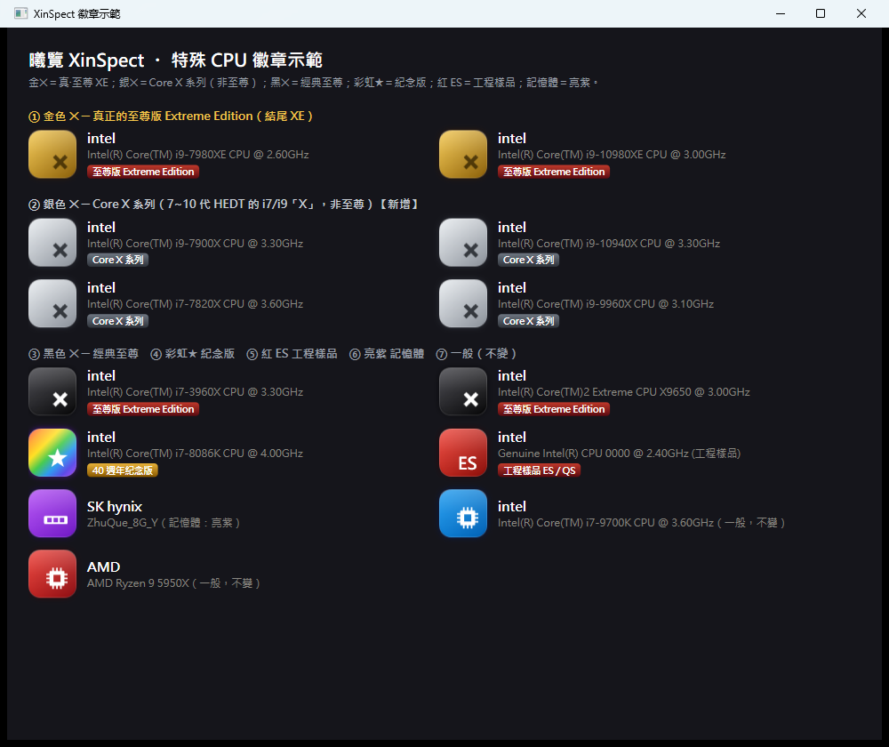

# 曦覽 XinSpect

> 一款專為 Windows 打造的原生硬體資訊總覽工具 — 即時感測、效能評測、超頻控制與一鍵裝機，全部整合於單一桌面應用程式。


-512BD4)


繁體中文原生介面。以 WPF（.NET 10）撰寫,採 MVVM 架構,整合 LibreHardwareMonitor 感測、WebView2 內建瀏覽器,並以獨立 net48 橋接程式承載 Intel XTU SDK 進行 CPU 超頻。



## 主要功能

- **硬體總覽** — CPU / 主機板 / 記憶體 / 顯示卡 / 儲存裝置的完整規格,含主機板廠商徽章與 CPU 官方 logo。
- **瓶頸診斷** — 把散在各頁的讀值合起來看一次,回答「現在是什麼在拖住這台機器」:溫度牆、功耗牆、單執行緒、記憶體、儲存、顯示卡、驅動 DPC、電源政策、MCA 平台事件,依「該先看哪一條」排序。每一條都附上產生它的數字與該去哪一頁量得更清楚;**沒量到的資料不會被當成沒問題**,而是列進「還沒納入判斷的部分」。全程唯讀,不會自動發動任何會讓機器發熱的量測。
- **記憶體插槽配置圖** — 主機板上每個插槽的實體排列,實心=有模組(容量／速率)、虛線=空槽。通道字母由韌體的插槽命名推斷;只寫 `DIMM0／DIMM1` 的板子就直說看不出通道,不硬湊 A/B——猜錯通道會害人把記憶體插到錯的槽。
- **即時感測** — 溫度、時脈、電壓、風扇、負載即時儀表,支援迷你懸浮視窗與系統匣。
- **溫度負載警示** — 可設定門檻,超標時橫幅提示 + 系統匣氣泡通知。
- **感測記錄** — 一鍵匯出 CSV,長期追蹤。
- **效能評測** — 內建多項基準測試,並可自我驗證:棋類跑分(中國象棋／西洋棋)以 perft 葉節點數當檢核碼,那是數學常數,算出別的數字就是這台機器算錯了,而不是比較慢。
- **效能天梯** — 離線 CPU / 顯示卡天梯榜(資料來源 topcpu.net),快速定位自己的硬體排名。
- **CPU 超頻** — 透過內建 Intel XTU 橋接程式調整倍頻 / 電壓。
- **顯卡超頻** — NVML 功耗 / 風扇 / 溫度監控 + NVAPI 時脈調整。
- **系統風扇控制** — 主機板 / Super I/O 上可控風扇的手動調速與一鍵還原自動（與感測共用同一套 LibreHardwareMonitor 引擎，真實寫入硬體）。
- **硬體檢測** — 「實用工具 → 硬體檢測」內建全螢幕螢幕壞點檢測、滑鼠按鍵 / 滾輪 / 回報率檢測、鍵盤逐鍵 / 防鬼鍵（NKRO）檢測、喇叭聲道與掃頻、動態拖影與幀間隔，純原生輸入事件、零外部相依。
- **一鍵裝機** — 整合 winget,勾選常用軟體批次安裝。
- **內建瀏覽器與終端機** — WebView2 內嵌瀏覽,以及真實 `cmd.exe` 終端機。
- **AI 評價** — 接 Ollama 或任意 OpenAI 相容端點,對本機硬體給出評語(提示詞可自訂)。
- **效能天花板** — 回答「這顆 CPU 為什麼跑不到它該有的頻率」：節流溫度 TCC、PL1／PL2 與時間窗、電流與供電警報、Turbo 倍頻表全部直接讀自 MSR（不是規格書數字），加上自開機以來撞過的牆（限制原因暫存器的黏滯紀錄位），再由使用者親自按下的逐窗撞牆量測（基線／整數／AVX2／AVX-512）以 APERF／MPERF 量出有效倍頻與作用中核心數，最後歸因成一句判決：溫度牆、功耗牆、電流牆、供電模組過熱、自主 P-state、多核渦輪上限，或「缺口不在硬體」。全程唯讀，**不寫入也不清除任何黏滯位**；能量計未通過自我驗證就只給原始計數、不換算成瓦。
- **硬核唯讀量測** — 直接編程 Intel PMU／MSR 的底層事實：Top-down 管線歸因、頻率真相（MPERF／APERF 與 Turbo 階梯）、平台可信度、BIOS 與 ME 微碼、逐核時間歸因、電源政策、記憶體真實面貌、機器檢查（MCA／WHEA）、核心間延遲矩陣、RDT 快取佔用。全部唯讀，取樣前後完整還原計數器；**量不到的項目一律拒絕出數字**而不是猜一個看起來合理的值。
- **診斷紀錄** — 所有「已接住、功能降級」的例外（MSR 被拒、WMI 失敗、感測器不存在）連同對使用者的實際後果，都列在設定頁並落地 `diag.log`；「量不到」與「程式有缺陷」不再長得一模一樣。
- **歷史回放與報告匯出** — 分鐘級極值長期落地,可回放任意時間窗;整機報告可匯出 HTML／Markdown／純文字(可選遮蔽可識別資訊)。
- **命令面板** — `Ctrl+K` 模糊搜尋直達 26 個分頁與 15 項實用工具。
- **集中設定** — 所有偏好以 JSON 持久化,支援一鍵初始化。
- **動態視覺效果(可關)** — 逐核液柱的液面／波紋／氣泡、風扇葉片轉速、七段數字面板,每一個「動」都對應一個真實讀值,沒有純裝飾的動畫。因為重繪要花 GPU 與封裝功耗,而那會進到量測結果裡,所以設有全站總開關;跑分與撞牆量測期間程式也會自行暫停動畫,且不會動到你的偏好設定。

## 系統需求

- Windows 10 / 11 或 Windows Server(x64)
- 部分功能(超頻、感測)需以**系統管理員**身分執行
- 顯卡超頻功能需 NVIDIA 顯示卡與對應驅動

## 建置

需要 [.NET 10 SDK](https://dotnet.microsoft.com/download)。

```bash
git clone https://github.com/Xinglanclever/XinSpect.git
cd XinSpect
dotnet build -c Release
```

執行:

```bash
dotnet run -c Release
```

發佈單一執行檔:

```bash
dotnet publish -c Release -r win-x64
```

> 建置時會自動以巢狀 MSBuild 編譯 `Bridge/`(net48 的 Intel XTU 橋接程式)並內嵌為資源,毋須手動處理。

## 技術棧

| 項目 | 說明 |
|------|------|
| UI | WPF (.NET 10),MVVM |
| 感測 | LibreHardwareMonitorLib |
| 系統資訊 | System.Management (WMI) |
| 內建瀏覽器 | Microsoft.Web.WebView2 |
| CPU 超頻 | Intel XTU SDK(net48 橋接程式) |
| 顯卡 | NVML / NVAPI |

## 授權

本專案以 [MIT License](LICENSE) 釋出。

> 注意:內建的第三方元件(Intel XTU SDK 等)受其各自授權條款約束,不在本專案 MIT 授權範圍內。

## 作者

By：Xinglanclever
