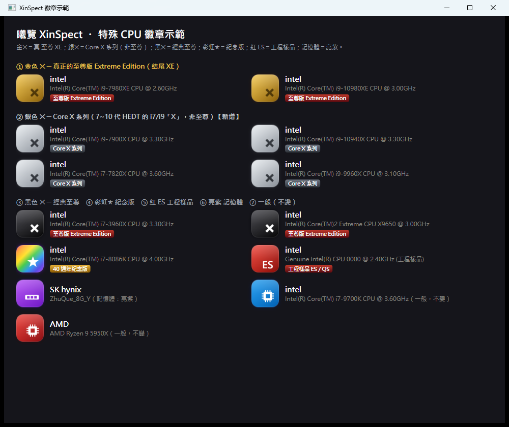

[简体中文](README.zh-CN.md) · 繁體中文

# 曦覽 XinSpect

一款免費開源、運行於 Windows 的原生硬體驗機、監控與安全稽核工具。以單一執行檔發佈，免安裝；對硬體與系統的讀取以唯讀為原則，少數涉及寫入的功能均設有同意閘門並明確標註風險。本程式不收集、不上傳任何使用者資料。


-512BD4)




## 定位

曦覽不對硬體下結論。它把三個來源的陳述並列攤開：硬體自己說的（MSR、PCI 設定空間、SMBUS 裝置、SMART）、韌體說的（ACPI 表、SMBIOS、UEFI 變數）、作業系統說的（WMI、登錄檔、事件記錄、效能計數器），讀得到就列出數值與來源，讀不到就標示原因。當兩個來源對同一件事有不同的說法，交叉對帳引擎會把矛盾列為紅字。判讀留給使用者。

適用場景：二手電腦買賣前的驗機、組裝後的硬體確認、系統不穩定時的歸因、安全狀態稽核、長期效能監控。

## 設計原則

以下原則不是宣言，每一條都有單元測試或機器檢查守著：

**三態標示。** 每筆事實帶 `availability` 欄位：`Present`（讀到）、`NotSupported`（平台不提供）、`InsufficientPrivilege`（權限不足）、`ReadError`（讀取失敗）、`NotApplicable`（本機無此硬體）。讀取失敗時程式顯示原因文字，數值欄位留空。程式碼中不存在以 0、0xFF、典型值或上一次讀值填補缺口的路徑；違反這條規則的實作會在程式碼審查與測試階段被攔下。

**來源可稽核。** 每筆事實的 `source` 欄位記錄資料出處：暫存器位址與位元位置、WMI 類別名稱、API 名稱。暫存器解碼器的方法必須附加 `SpecRef` 屬性（文件、章節、暫存器、位元），`SpecRefRegistry` 以反射逐一檢查已註冊解碼器的每個公開方法，缺引用即測試失敗。

**非自造驗證。** 量測類功能在輸出數字前先驗證量測本身：棋類跑分以 perft 葉節點數為檢核碼（數學常數，偏離即計算錯誤而非效能差異）；記憶體頻寬換算前以已知大小的負載自我驗證，對不上時只輸出原始計數器值；PMU 編程驗證逐輪確認寫入讀回一致與還原完整。

**不重複造輪也不重複宣稱。** 同一事實若已有多個來源，程式不做單來源宣稱，而是交叉比對。兩來源一致時給「一致」，不一致時給「矛盾」並具名列出雙方，任一缺席時給「無法驗證」。

**查不到不等於沒有。** 查詢語言與本機 API 對「存在但讀不到」的項目照樣返回匹配與原因；語法錯誤返回 400 與修正指引，不以空結果偽裝。

## 系統架構

| 元件 | 形態 | 職責 | 權限 |
|---|---|---|---|
| 曦覽主程式 | WPF（.NET 10，單檔發佈） | 介面、事實收集、對帳、報告 | 多數功能不需要；MSR／SMART／Security log 需系統管理員 |
| WinRing0 | 既有核心驅動（反射載入 LibreHardwareMonitor Ring0 模組） | MSR／PCI 設定空間／實體記憶體 MMIO 讀取主力 | 系統管理員 |
| XsRegProbe | 本專案自寫的白名單唯讀驅動（源碼在 `XsRegProbe/`） | 允許清單內的 MSR／MMIO 讀取備援；允許清單外一律拒絕；退出即卸載 | 系統管理員，需自行編譯簽章 |
| Intel XTU 橋接 | net48 獨立進程（Release 建置自動內嵌） | 承載 XTU SDK 供 CPU 超頻 | 系統管理員 |
| 藍色中隊守護進程 | .NET 10 console（Release 建置自動內嵌） | ETW 即時威脅偵測、驅動基線、stdin/stdout JSON IPC | 使用者權限 |

內嵌機制：Release 建置時以 MSBuild Target 發佈橋接程式並內嵌為資源；執行期首次使用時解壓至 `%LOCALAPPDATA%\XinSpect\`，先以 SHA-256 對內嵌正本驗證、目錄 ACL 收緊為 SYSTEM＋Administrators，驗證不過即拒絕執行。Debug 建置不內嵌，以開發路徑搜尋。

## 下載與系統需求

| 檔案 | 大小 | 用途 |
|---|---|---|
| [XinSpect.exe](https://github.com/Xinglanclever/XinSpect/releases/download/v2.5.0/XinSpect.exe) | 29,716,269 bytes | 主程式。已內含藍色中隊守護進程 |
| [BlueSquadronBridge.exe](https://github.com/Xinglanclever/XinSpect/releases/download/v2.5.0/BlueSquadronBridge.exe) | 6,502,948 bytes | 獨立守護進程。僅在需要脫離主程式單獨運行防護時使用 |

系統需求：Windows 10 1903 或更新、Windows 11 x64；.NET 10 Desktop Runtime（可改用自包含發佈）。無防毒軟體相容性問題的回報紀錄；WinRing0 為雙用途驅動，部分企業環境的應用程式控制政策可能攔截，攔截時相關事實標示「權限不足」，程式不降級宣稱。

## 功能詳述

以下依主介面左側導覽的群組順序說明。每一節先列資料來源，再列邊界（不做什麼、為什麼）。

### 總覽

**我的電腦／總覽。** 來源：WMI（Win32_Processor、Win32_PhysicalMemory、Win32_VideoController、Win32_DiskDrive、Win32_BaseBoard）、SMBIOS、CPUID。呈處理器／主機板／記憶體／顯示卡／儲存的規格摘要。記憶體插槽配置圖依 SMBIOS 的實體排列繪製，實心代表有模組（附容量與速率）、虛線代表空槽；通道字母僅在韌體插槽命名可辨識時標示，僅有 `DIMM0/DIMM1` 命名的板子會標明「無法辨識通道」，不做推論。

**瓶頸診斷。** 來源：各頁已收集的事實。將溫度牆、功耗牆、單執行緒、記憶體、儲存、顯示卡、驅動 DPC、電源政策、MCA 平台事件等指標合併評估，依優先序排列。每條判斷附產生它的原始數字與對應的深入量測頁面。未被量測涵蓋的項目列於「還沒納入判斷的部分」，不計入結論。

**AI 評價。** 來源：使用者設定的 Ollama 或 OpenAI 相容端點。將本機硬體摘要交由語言模型生成評語，提示詞可自訂。此為全程式少數會產生網路流量的功能之一，僅在使用者主動呼叫時發生。

### 處理器

來源：CPUID、MSR（經 WinRing0 逐核綁定讀取）、登錄檔。

- **CPUID 解讀**：家族／型號／ stepping 含 extended family 進位（此進位曾因實作漏做而由突變測試發現並修正）；指令集支援；快取拓撲；die 拓撲（CPUID leaf 0x1F，未支援時標示 NotSupported，不退回 leaf 0xB 推測）。
- **微碼修訂**：雙來源交叉——CPU 側讀 MSR 0x8B 高 32 位（逐實體核綁定，不一致時列出各核清單而不取單核值）；Windows 側讀登錄檔 `Update Revision`（8 位元組與 4 位元組兩種實測佈局皆支援，雙 DWORD 皆非零的歧義標示「不解碼」）。兩來源一致／矛盾由對帳規則裁決。
- **TjMax**：MSR 0x1A2 bits[23:16]。
- **頻率真相**：MPERF/APERF 比值與 Turbo 階梯，取樣前後完整還原。
- **TME／SGX 記憶體加密**：TME 以 CPUID leaf 7 ECX bit25 與 MSR 0x982（啟用位與演算法欄）判定；SGX 以 leaf 7 ECX bit30 判定。未支援如實標示。
- **C-state 駐留**：MSR 0x60D（C2）、0x3FC（C3）、0x3F9（C6）、0x3FA（C7），單位 µs，平台未實作的項目標 NotSupported。
- **PMU**：能力探索（CPUID leaf 0xA：版本、通用與固定計數器數量與位寬）為唯讀且已出貨；編程驗證（寫入 IA32_FIXED_CTR_CTRL 使能位→讀回一致→已知工作量→計數器活動確認→還原讀回確認，3 輪聚合）採同意閘門，寫入範圍僅限使能位、以 OR 併入原值、不觸及 PMI 位元。此功能標註「多輪測試・不保證可用」，與 wpr 等參考工具的對照（沙箱方案 S5）尚未執行。
- **效能天花板**：TCC 節流溫度、PL1/PL2 與時間窗、電流限制、供電警報、Turbo 倍頻表直接讀自 MSR；限制原因暫存器為黏滯紀錄位；另有使用者觸發的逐窗撞牆量測（基線／整數／AVX2／AVX-512）以 APERF/MPERF 量有效倍頻。輸出為單句歸因（溫度牆／功耗牆／電流牆／供電過熱／自主 P-state／多核上限／缺口不在硬體）。唯讀，不清除黏滯位。

### 記憶體

來源：SMBUS（經白名單位址）、SMBIOS、WMI、ACPI SLIT。

- **SPD 直讀**：DIMM 的製造商、序號、時序參數，每筆標明讀取的匯流排；TSOD 溫度感測器。
- **插槽配置**：實體排列、通道辨識（見總覽節）。
- **ECC 現況**、標稱與實際速率對照。
- **Rowhammer**：程式僅提供風險聲明與壓力探測，不做正規施測。壓力探測在自擁有的連續緩衝區內以兩個熱點高頻讀寫、xorshift 樣本逐位元組驗證（熱點偏移排除）；需要使用者明確同意（服務層對未同意呼叫直接拒絕）；介面與結果均標註「未經過校驗」——usermode 無法執行 clflush，此探測不保證觸發 Rowhammer，結果不構成記憶體可靠性的結論。多輪模式（10 輪聚合）同樣標註：多輪零翻轉不表示具備抗性。
- **NUMA**：拓撲（GetNumaHighestNodeNumber／ProcessorMaskEx）、節點距離矩陣（ACPI SLIT，宣告與資料不符時拒解）、TLB 與大分頁成本量測。

### 主機板

來源：SMBIOS、ACPI（經 GetSystemFirmwareTable）、Super I/O 設定埠、PCI 設定空間。

- **機箱開啟偵測**：SMBIOS Type 3（System Enclosure）offset 12 的 Security Status。值 5（Intrusion detected）表示韌體記錄了機殼開啟事件——這是拆機的韌體級證據，介面以警示色呈現。機箱類型（offset 5）一併解出。
- **Super I/O**：0x2E/0x4E 設定埠進入、晶片 ID 與廠商 ID（名稱對照取自 coreboot superiotool）、HWM 感測器（LDN 4 基址→base+5/+6 讀取）：風扇 RPM（ITE 公式 1,350,000÷(divisor×count)，count 0/0xFFFF 為無效）、溫度（8-bit 二補數）、電壓（LSB 16 mV，標明未經主機板分壓校準）。設定模式在任何路徑（含例外）都以 finally 退出。
- **PCI 盤點**：Bus 0 三十二槽掃描，多功能位元決定 function 掃描；PCI-SIG 類別碼知識庫轉角色名稱；BAR 資源解碼（大小需寫入探測，故只列位址與類型）。
- **ReBAR 實況**：查 Windows 實際指派給裝置的記憶體範圍（生效值，非能力宣稱值），不需驅動。
- **SPI 快閃稽核**：HSFSTS 旗標（FLOCKDN/WRSDIS/FDOPSS）、FRAP 區域權限、FREG 地圖、PR 保護範圍；BIOS 區 SHA-256；與使用者提供的參考映像逐 4 KB 塊比對（大小不符拒比）。
- **ACPI 表列**：表頭校驗和驗證；MCFG（ECAM）、HEST（硬體錯誤源）、BERT（開機錯誤記錄）、SLIT（節點距離）、CEDT（CXL 固定記憶體窗口，CFMWS 逐欄）、HPET、FADT（PM timer 區塊）。無對應表時標 NotApplicable。
- **CMOS/RTC**：電池電壓（VRT）、時鐘（BCD/12h 解碼）、PC-AT 校驗和；絕不寫 0x71。

### 儲存裝置

來源：SMART_RCV_DRIVE_DATA ioctl（disk.sys 代理，不用 ATA_PASS-THROUGH）、NVMe Storage Query Property、WMI。

- **SMART 屬性與門檻**：READ DATA（0xD0）取屬性表、READ THRESHOLDS（0xD1）取門檻表。「現值 ≤ 門檻且門檻非 0」判定為現正低於門檻（failing now），逐項攤開；門檻 0 依規範為無門檻，不評比。
- **NVMe**：健康紀錄（log page 0x02）全解、WCTEMP 警告（Identify Controller offset 0x14A 對照合成溫度）、錯誤紀錄（log page 0x01）、電源狀態表對實測閒置喚醒延遲。
- **HPA 隱藏容量**：ATA IDENTIFY 的最大 LBA 對照 Win32_DiskDrive.Size——OS 可見少於韌體聲明即 HPA 作用中，換算隱藏容量。DCO 需廠商私有命令，標示 NotSupported 並說明原因。
- **表面掃描**：循序讀取逐塊（預設 1 MB）量延遲，超過 100 ms 標慢、讀取失敗標錯誤。SMART 是韌體的自述，這是程式自己讀到的。
- **假容量寫入驗證**：在目標磁碟以可重現樣本（chunkIndex 混入種子）寫入至指定上限或寫滿，FlushToDisk 後讀回逐位元組驗證，結束刪除暫存檔。需要明確同意；寫入量可觀且可能加劇瀕死媒體損耗，介面與說明均標註風險。此功能未接入任何自動流程，僅在明確呼叫時執行。
- 通電時數與機齡推估、QD 梯度效能。

### 顯示卡

來源：NVML（NVIDIA）、NVAPI、D3DKMT、登錄檔。

- NVML：溫度、頻率、功耗、風扇、溫度閾值、退休頁（nvmlDeviceGetRetiredPages_v2，single/double-bit 合計；本測試機實測該卡不支援退休頁報告，標 ReadError）。
- GPU 深測：光柵填充率、紋理取樣、H.264 編碼、計算管線、PCIe 頻寬（D3D11 readback 對 CPU 參考比對，防止全零輸出誤判為有效）。
- HDR 能力：EDID CTA-861 HDR Static Metadata＋DisplayConfig 開關。
- 顯示鏈路真相：連接技術、像素時鐘、色彩編碼、位元深度、所需影像資料率——頻寬不足時驅動自行降色度，設定介面不會反映。
- TDR 設定：TdrLevel/TdrDelay/TdrDpcDelay 登錄檔值；未設定時標明 Windows 預設值。
- 超頻：NVML 功耗／風扇／溫度監控＋NVAPI 時脈調整，快照→回讀驗證→看門狗→自動還原。

### 網路

來源：WMI（MSFT_NetAdapterStatistics、Win32_NetworkAdapter）、wlanapi、登錄檔。

- 介面統計：錯誤與丟棄計數非零的介面逐條列出（驅動劣化、線材、交換器埠的第一手指紋）。
- MAC OUI 對照：IEEE 登記的知名前綴子集（比照 Super I/O 知識庫模式），未收錄如實標示。
- Wi-Fi：RSSI、頻道（BSS list 中心頻率依 IEEE 802.11 Annex E 換算，頻率在等差之外回 null 不猜）、認證類型；介面未連線時如實列示「未連線」，不與「無介面」混報。
- 網路卸載（Checksum/RSS）、網卡進階屬性、網速測試、網路延遲量測。

### 安全

韌體安全頁與防護頁。來源：MSR、PCI、UEFI 變數、WMI、X509Store、事件記錄、使用者提供的清單檔。

- **韌體安全暫存器**：BIOS_CNTL（SMM_BWP/BLE/WE）、SMRAMC（D_LCK/D_OPEN）、ME 狀態（HFSTS1，先驗 0:16.0 為 Intel HECI）、IA32_FEATURE_CONTROL（Lock/VMX）、IA32_DEBUG_INTERFACE（ENABLE/LOCK/DEBUG_OCCURRED）、SPI 旗標與區域權限。每項給裁決文字，不利裁決（BLE=0、D_LCK=0、除錯埠開放）以警示色呈現。
- **交叉對帳**：26 條規則（外部化於 `Rules/builtin.json`，每條附 SpecRef 與誤報條件）對同一批事實做語義與管線一致性檢查。判決三種：一致／矛盾／無法驗證。矛盾整列紅字並具名列出雙方輸入。
- **平台可信度**：hypervisor 存在位與簽章、VBS/HVCI（Win32_DeviceGuard）、核心程式碼完整性選項、Invariant TSC。VBS 執行中時明確告知：MSR 類卡片只能當參考。
- **BYOVD 比對**：載入中核心模組對微軟「建議的驅動程式封鎖規則」比對。清單 XML 由使用者提供（放入程式目錄或以 CLI 指定），零網路存取；比對兩道——檔名（不分大小寫）與 SHA-256/SHA-1（對實檔計算）。命中列出模組路徑與規則依據；語意是「在封鎖清單上的攻擊面事實」，不是中毒判決。
- **安全鑑識**：Defender 排除清單（MSFT_MpPreference，逐條攤開）、Security log 1102 記錄清除事件（需提權，權限不足與查詢失敗分開標示）、非微軟本機信任根（X509Store Root，MITM 憑證風險面）、USBSTOR 使用痕跡、驅動簽章稽核（Win32_PnPSignedDriver 的 IsSigned）。
- **藍色中隊（防護頁）**：六防線即時態勢（DMA 與記憶體保護、韌體與啟動鏈、CPU 緩解、儲存與資料、驅動與對抗、系統攻擊面）＋ETW 即時威脅時間軸。守護進程已內建主程式（見系統架構節），安全頁滑動開關控制啟停並記入設定檔；關閉時唯讀態勢評估照常。
- **深層存取豁免開關**：產生自簽 CA（RSA-4096，只放行這一張憑證，不開全機 test-signing）→ 安裝 XsRegProbe 服務。關閉＝停止並刪除服務、只移除自己 CA 的 thumbprint。非提權時不做任何變更。

### 系統與軟體層

事實實驗室的軟體面。來源：WMI、登錄檔、事件記錄、LSA、COM、psapi。

Windows Update 歷史（WUA COM：最新一筆、30 天內安裝數、失敗計數）；服務盤點（Win32_Service：總數、執行中、自動、停用、非系統目錄服務）；事件記錄摘要（System log 7 天內嚴重＋錯誤，最常見來源×事件 ID）；稽核政策（LSA LsaQueryInformationPolicy，九類別等級）；機器原則檔（Registry.pol 存在與寫入時間指紋，不解析二進位）；選用功能（Win32_OptionalFeature：Hyper-V Hypervisor／虛擬機器平台／WSL／容器，WMI 未回報的項目標「未回報」而非「停用」）；核心模組載入清單（EnumDeviceDrivers，非系統目錄模組逐檔 Authenticode 驗證）；開機參數（SystemStartOptions：核心除錯、測試簽章）；開機計時（Diagnostics-Performance Event 100 的 BootTime）；USB 拓撲；攝影機列舉；企業儲存（iSCSI/MPIO 看 SCM 服務、FC 看 WMI HBA、NVMe-oF 標示偵測路徑未實作）。

### 深測中心

38 項 Run Session。目錄全量登記：可執行與延後項目都會攤開，不把未跑的項目說成量測。只並列原始樣本、可信度（High/Medium/Low/Insufficient）與限制，不加權合成總分；跨域、跨數據體排名不成立。混合不同量測配置的樣本會被混池判定攔下（梯子型指標逐點呈現）。

測項涵蓋：CPU AES/SHA 吞吐、Load-to-use/ILP/branch 延遲、分支式矩陣、RDRAND/RDSEED、Intel PMU Top-down、核心延遲、核心到核心搬運頻寬、SMT sibling 競爭、cache bandwidth/latency 階梯、lock-scaling、NUMA/TLB/大分頁對照、DRAM 映射推論、記憶體頻寬、合成 JSON 往返、D3D11 光柵/紋理、GPU 光柵/紋理/編碼、儲存複合（FlushToDisk→讀回→GPU 雜湊→回讀比對）、QD 梯度、耦合 loopback、WASAPI 訊號級、多域 gauntlet、UX 合成負載、統計引擎自我稽核（已知答案合成樣本集逐案例驗證分類行為）。

### 監控與量測

- **感測器**：LibreHardwareMonitor 引擎，溫度／時脈／電壓／風扇／負載；迷你懸浮視窗、系統匣、超標警示（橫幅＋氣泡）、CSV 匯出、歷史回放。
- **效能**：棋類跑分（perft 檢核）、算力圖（離線天梯，來源 topcpu.net）、幀時間監測、DPC 延遲、執行緒遷移（ETW Context Switch 事件四層歸因：SMT 兄弟／同 LLC／跨 LLC／跨 NUMA；扣掉量測自身執行緒；行程排名依遷移率）、L3 未命中與 DRAM 流量（已知負載自我驗證）、大頁與位址轉換成本（同一指標鏈在 4 KB/2 MB 頁各跑一次）、NPU 檢測。
- **硬核唯讀量測**：SMI 次數（韌體在 OS 看不見的模式處理，工作管理員恆為 0%；只給次數不乘推測耗時）、MCA/WHEA 機器檢查、核心間延遲矩陣、RDT 快取佔用、電源政策、BIOS 與 ME 微碼。

### 證據實驗室

- **時間膠囊**：全機事實快照。SHA-256 完整性信封（canonical JSON）、匿名機器識別（單向雜湊派生）、敏感值遮蔽（保留需主動指定）。跨快照逐欄差分；資產生命週期事件自動分類（記憶體／處理器／顯示卡／儲存／主機板的新增、移除、變更；其餘變更標「狀態」不冒充硬體變更）。
- **原始暫存器快照**（.xinraw）：PCI 安全暫存器、ACPI 整表、MSR、SPIBAR、MCHBAR 的原始位元組；SHA-256 信封，竄改拒載；揮發位元（SMI 計數等）標注。
- **HTML 報告**：單檔自足、尾端 SHA-256 標記可離線重算驗證。
- **corpus 貢獻包**（格式 v1 骨架）：只接受遮蔽版快照、身份鍵逐鍵排除；上傳通路刻意未實作，重開前需逐次同意、本地預覽、資料主權聲明與伺服端不改寫四項條件。

### 工具箱與實用工具

- **工具箱**：Windows 內建工具一鍵開啟；八十餘款第三方硬體工具的官方下載捷徑。寫韌體、整碟抹除類項目掛「危險」／「注意」徽章並寫明最壞情況；無官方發佈站的工具不收錄。
- **硬體檢測**：螢幕壞點、滑鼠按鍵／滾輪／回報率、鍵盤逐鍵與 NKRO、喇叭聲道與掃頻、動態拖影與幀間隔。純原生輸入事件，零外部相依。
- **超頻與風扇**：CPU 超頻（XTU 橋接，倍頻與電壓在同一張目標時脈規劃卡，含類比電壓錶）；顯示卡超頻（NVML/NVAPI）；系統風扇手動調速與一鍵還原自動（真實寫入 Super I/O）。
- **系統工具**：一鍵裝機（winget）、垃圾清理、大檔掃描、連接埠占用、Hosts 編輯器、右鍵選單管理、Windows 授權、睡眠與喚醒、DNS 切換、記憶體整理、開機啟動項、運算穩定性壓測、藍屏分析、系統引導修復。
- **顯示與輸入**：螢幕色域、USB 鏈路、PCIe 鏈路。
- **內建瀏覽器**（WebView2）與**終端機**（cmd.exe）。
- **進階驅動分析／作業系統分析**：驅動簽章、日期與關鍵類別老化；OS 層安全性事實。

### 風險與同意閘門

下表列出所有涉及寫入或潛在風險的操作，及其防護機制：

| 功能 | 寫入內容 | 防護 |
|---|---|---|
| Rowhammer 壓力探測 | 自擁有緩衝區內高頻讀寫 | 同意閘門（UI 勾選＋服務層拒絕）；「未經過校驗」標註；無自動接線 |
| 多輪壓力模式 | 同上，10 輪 | 同上；明寫多輪零翻轉不表示具備抗性 |
| PMU 編程驗證 | IA32_FIXED_CTR_CTRL 使能位（OR 併入，不碰 PMI） | 同意閘門；每輪 finally 還原原值；「多輪測試・不保證可用」標註 |
| 假容量寫入驗證 | 目標磁碟大量寫入（至上限） | 同意閘門；危險聲明（加劇瀕死媒體損耗）；結束刪檔；無自動接線 |
| 磁碟表面掃描 | 無（純讀取） | 僅讀取；可取消 |
| 深層存取開關 | 安裝自簽 CA 與驅動服務 | 非提權拒做；關閉完全移除；只放行自己的憑證 |
| CPU／顯卡超頻、風扇調速 | 硬體狀態寫入 | 快照→回讀驗證→看門狗→自動還原鐵律 |

## CLI 與自動化

```
XinSpect.exe --json evidence [--query <查詢>] [--out <檔案>]
```

退出碼：0＝全部事實 Present；2＝部分事實為三態；1＝致命錯誤。

查詢語言：一行一子句，欄位為 key／category／source／value／availability／since／until，運算子為 `=`（精確）、`~=`（包含）、`^=`（前綴）；availability 支援別名（ok／error／no-permission）。規格全文見 `docs/spec/query-language.v1.md`，解析器與文件由測試對帳。

PowerShell：`XinSpect.psm1` 提供 `Get-XinSpectEvidence`。

本機 API：`GET /api/facts` 返回全部事實（canonical JSON，與時間膠囊同一形狀）；`POST /api/query` 接受查詢語言全文。設計為 loopback 唯讀；HTTP 監聽殼未自動啟動。

## 公開規格與文件

| 文件 | 內容 |
|---|---|
| `docs/spec/snapshot.schema.v1.json` | 時間膠囊 JSON Schema（2020-12），與實際序列化逐鍵機器對帳 |
| `docs/spec/query-language.v1.md` | 查詢語言規格（解析器與文件由測試對帳） |
| `docs/spec/METHODOLOGY.md` | 事實來源契約：三態、SpecRef、交叉對帳、突變測試 |
| `docs/MEASUREMENT-METHODOLOGY.md` | 量測方法學：混池禁令、時間源分工、臨界值成文 |
| `docs/spec/LIMITATIONS.md` | 公開限制：設計裁決與能力邊界逐條 |
| `docs/EC-RISK-ASSESSMENT.md` | EC 埠存取風險評估（結案：不實作，重開條件成文） |
| `docs/PMU-SANDBOX-PLAN.md` | PMU 編程沙箱驗證方案（S1–S5） |
| `docs/DATA-SOVEREIGNTY.md` | 資料主權聲明（含零網路 API 的機器檢查） |
| `docs/DEPLOYMENT.md` | 部署與企業維運（發佈、CLI、資料位置、升級回滾） |
| `docs/ITERATIONS.md` | 完整迭代帳本（60+ 批次、逐輪內容、測試數、提交） |

## 品質保證

- **單元測試**：3094 項，全數通過。涵蓋每個解碼器的金標向量、每個服務的三態行為、每條對帳規則的逐情境行為。
- **突變測試**：Stryker 對 XinSpect.Decoders 類別庫執行，分數 82%。知識表資料檔（SuperIoKnowledge/PciKnowledge）刻意排除——逐條字串斷言等同快照重複。
- **SpecRef 覆蓋**：反射檢查已註冊解碼器的每個公開方法都有規格引用。
- **Property 測試**：FsCheck 對遮罩差分、MCFG 編碼等性質做隨機驗證。
- **差分測試**：SMBIOS 記憶體解碼與微軟 Win32_PhysicalMemory 對照（同表雙實作）。
- **文件對帳**：README 版號、Changelog、csproj 三處一致由測試把關；規格文件與解析器的漂移會紅燈。

## 隱私與資料主權

- 事實蒐集與解碼層的原始碼經機器檢查掃描，不含任何網路 API（HttpClient、TcpClient 等）。全程式僅有的網路功能：AI 評價、意見回饋、網速測試、網路延遲量測——全部需要使用者主動觸發。
- 資料僅存於本機：審計日誌在 `%ProgramData%\XinSpect\Audit\`、驅動憑證在 `%ProgramData%\XinSpect\Driver`、快照與報告在使用者指定路徑。刪除檔案即完成刪除，無雲端副本。
- 匿名機器識別為單向雜湊派生（`sha256:` 前綴），不含序號原文。敏感值預設遮蔽。
- 自我遙測預設關閉、匿名、僅本機存取。

## 已知限制

- 突變測試僅涵蓋純解碼器類別庫；主程式的特權通路層由注入式測試與金標向量承擔。
- PMU 編程驗證尚未與參考工具對照（沙箱方案 S5 未執行）。
- Rowhammer 壓力探測非保證觸發，不能作為記憶體可靠性的結論。
- DCO（Device Configuration Overlay）需廠商私有命令，未實作。
- MCHBAR 記憶體時序（tCL/tRCD/tRP/tRAS）屬 MRC 訓練結果區，Intel 公開文件未定義，不出值。
- PCH 世代名稱對照未對準出處前不出值。
- Wi-Fi 連線態欄位需介面實際連線才能讀取。
- HVCI／VBS 開啟時 MSR 可能被攔截或回虛擬值，可信度裁決在平台可信度頁明示。

完整限制清單見 `docs/spec/LIMITATIONS.md`。

## 從源碼建置

```
git clone https://github.com/Xinglanclever/XinSpect.git
cd XinSpect
dotnet build XinSpect.csproj -c Release
dotnet test Tests/XinSpect.Tests.csproj
dotnet publish XinSpect.csproj -c Release -r win-x64 --self-contained false -p:PublishSingleFile=true -p:IncludeNativeLibrariesForSelfExtract=true
```

Release 建置會自動發佈並內嵌 XTU 超頻橋接（net48）與藍色中隊守護進程；Debug 建置不內嵌以縮短建置時間。XsRegProbe 驅動需自行編譯簽章（`XsRegProbe/BUILD-給使用者.md`）。

## 版本沿革

- **v2.5.0 Olympus**（2026-10-04）：系列更名 Everest→Olympus；WinRing0 回歸主力；交叉對帳 26 條；驗機殺手級檢測（SMART failing-now、機箱開啟、HPA、假容量驗證、WCTEMP、TDR、退休頁）；安全鑑識（BYOVD、Defender 排除、1102、信任根、USBSTOR）；處理器深化（TME/SGX、C-state、PMU、die 拓撲、SLIT）；系統軟體層（Update 歷史、服務、稽核政策、核心模組、USB、螢幕、網卡）；藍色中隊內嵌本體；深測中心 38 項；公開規格；DeepBench 啟動崩潰修復；突變測試解鎖。
- **v2.1.0 Everest**（2026-10-02）：韌體安全頁、深層暫存器、XsRegProbe 驅動、深層存取開關、Deep Bench 20、守護進程三版。

## 授權

本專案以 [MIT License](LICENSE) 釋出。內建第三方元件（Intel XTU SDK、LibreHardwareMonitor、TraceEvent、NAudio 等）受其各自授權條款約束，不在本專案 MIT 授權範圍內。WinRing0 為雙用途驅動，本程式的 MSR 讀取亦依賴它；使用者應僅在自有或獲授權的機器上使用。

## 作者

By：Xinglanclever
